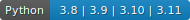

# Spectro Inlets Quantification

[//]: # (The python version badge is generated with anybadge like so)
[//]: # (anybadge -o -l Python -v "3.8  | 3.9 | 3.10 | 3.11" -f .python_version_badge.svg -c "#1182C2")

[](https://www.python.org/)
[](https://github.com/SpectroInlets/spectro_inlets_quantification)
[](https://github.com/psf/black)
[](https://github.com/charliermarsh/ruff)
[](https://pycqa.github.io/isort/)

Documentation for this package is [here](https://spectroinlets-spectro-inlets-quantification.readthedocs-hosted.com/en/v1.1/)

## Developing

To get a development environment setup, make a virtual environment and install invoke and then run
the dependencies invoke task:

```bash
 $ python -m pip install invoke
 $ invoke deps
```

## License

Spectro Inlets Quantification is dual licensed under a proprietary
license and the GPL-3.0. See the file DUAL\_LICENSE for details.

